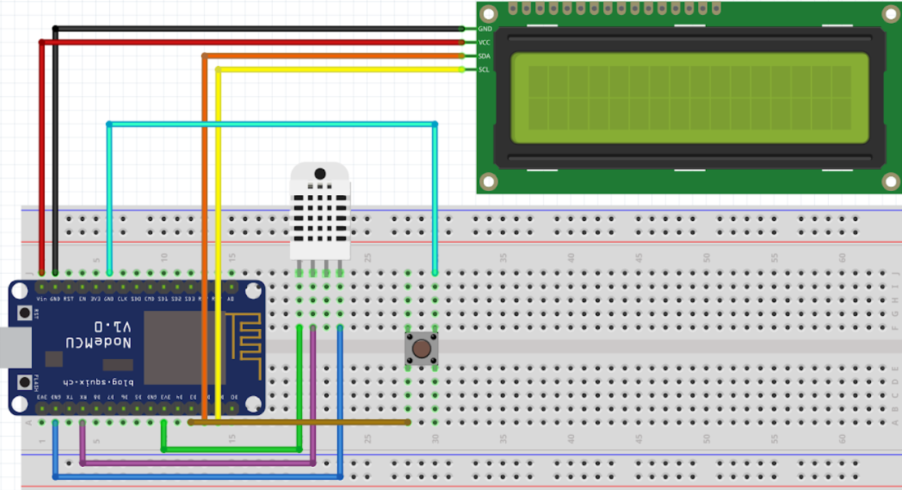

# PSC

For the course Platform, Sensors and Communication I needed to create an IoT thing for myself. So I created a mini weather station. It displays the temperature and humidity of my room on a 16x2 LCD display. Furthermore it can also fetch data from the [OpenWeather API](https://openweathermap.org/) and display that too. 

--- 

## Table of Contents
  - [Prerequisities](#prerequisites)
  - [Getting Started](#getting-started)
    - [Wiring](#wiring)
    - [NodeMCU Setup](#nodemcu-setup)
    - [Installing Libraries](#installing-libraries)
  - [Built With](#built-with)

---

## Prerequisites
| Parts needed                              | Amount |
| :---------------------------------------- | -----: |
| NodeMCU/ESP8266                           |     1x |
| DHT11 Temperature & Humidity Sensor       |     1x |
| I2C Liquid Crystal LCD Display (16x2 LCD) |     1x |
| Push Button                               |     1x |
| Breadboard                                |     1x |
| Micro usb                                 |     1x |
| Male to Male jumper wire                  |     4x |
| Female to Female jumper wire              |     9x |

---

## Getting Started

### Wiring

 

**LiquidCrystal LCD I2C display**

The pins of the LiquidCrystal LCD display from top to bottom are: **GND**, **VCC**, **SDA** and **SCL**.
  1. Connect the **GND** pin to the NodeMCU **GND** pin.
  2. Connect the **VCC** pin to the NodeMCU **Vin** pin.
  3. Connect the **SDA** pin to the NodeMCU **D2** pin.
  4. Connect the **SCL** pin to the NodeMCU **D1** pin.

 

**DHT11 sensor**

The pins of the DHT11 sensor from left to right are: **VCC**, **DATA**, **NC** (not connected) and **GND**.
1. Connect the **VCC** pin to the NodeMCU **3.3V** pin.
2. Connect the **DATA** pin to the NodeMCU **RX** pin.
3. Connect the **GND** pin  to the NodeMCU **GND** pin.

 

**Push Button**
1. Connect one side of the push button to **GND**.
2. Connect the other side of the push button to **D3**.

---

### NodeMCU Setup
1. Open the Arduino IDE
2. Go to `File` > `Preferences`.
3. In the Settings tab you will find the label `Additional Boards Manager URLs`.
   Add the following URL in the input field and then hit OK.
   http://arduino.esp8266.com/stable/package_esp8266com_index.json
4. Go to `Tools` > `Board` > `Boards Manager`.
5. Search for `esp8266 by ESP8266 Community` and install it.
6. Select the NodeMCU board from `Tool` > `Board` > `NodeMCU 1.0 (ESP-12E Module)`.

---

### Installing Libraries
**LiquidCrystal I2C**
1. Open the Arduino IDE and go to `Tools` > `Manage Libraries…`.
2. Search for the term `Liquid Crystal I2C`.
3. Install the library named `LiquidCrystal I2c by Frank de Brabander`.

 

**DHT11 Sensor**
1. Open the Arduino IDE and go to `Tools` > `Manage Libraries…`.
2. Search for the term `DHT`.
3. Install the library with the name  `DHT sensor library by Adafruit`.
4. A popup will show up asking to install the necessary dependencies, select `Install all`.

 

**ArduinoJSON**
1. Open the Arduino IDE and go to `Tools` > `Manage Libraries…`.
2. Search for the term `ArduinoJSON`.
3. Install the library named `ArduinoJson by Benoit Blanchon`. Make sure it is version 5.13.1.

---

## Built With
* [Arduino](https://www.arduino.cc/) 
* [OpenWeather](https://openweathermap.org/)